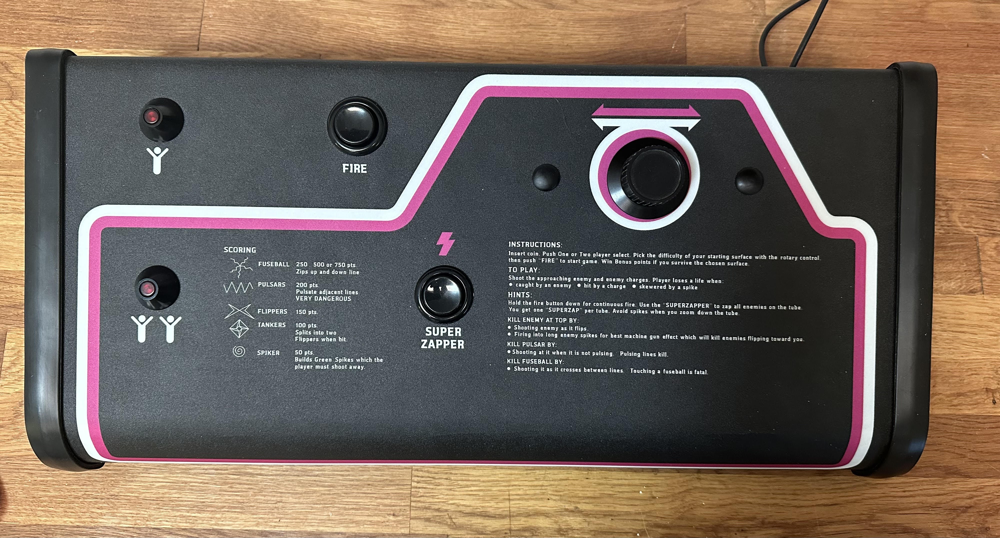

# Tempest Arcade Controller

## Bill of materials

* 1 x Panel: 1.5mm cold rolled steel sheet
* 1 x[Tempest Mini/Cabaret Control Panel Overlay](https://www.arcadeshop.com/i/834/tempest-mini-cpo.htm)
* 2 x [Atari Tall Black "Volcano" Button Cone Bezel](https://www.arcadeshop.com/i/568/atari-tall-black-button-cone.htm)
* 2 x [Atari Lighted Start Push Button](https://www.arcadeshop.com/i/1539/atari-lighted-start-push-button.htm)
* 2 x Generic black arcade pusbutton
* 1 x Tempest spinner / spinner replica (I used the replica spinner from [Oscar Controls](https://mirrors.arcadecontrols.com/OscarControls/order-paypal.htm))
* 1 x [Ultimarc I_PAC control interface for buttons](https://www.ultimarc.com/control-interfaces/i-pacs/)
* 1 x [Ultimarc Opti-PAC control interface for the spinner](https://www.ultimarc.com/control-interfaces/opti-pac/opti-pac/)
* A length of [T-molding](https://www.arcadeshop.com/search?q=molding) 
* 3D printed parts can be found here([STL](./stl/)/[STEP](./step/))
* M3 & M4 screws

A video of the build process can be found here: [Building a Tempest Arcade Control Panel Replica](https://www.youtube.com/watch?v=M-017ND0Ewc).

All parts are printable on a 3D printer with a 400x400mm print bed.

